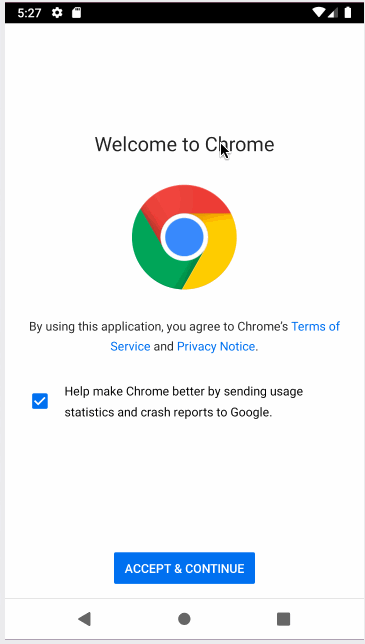

# Project 3 - SimpleTweets

SimpleTweets is an Android app that implements basic Twitter functionalities.

Submitted by: Carolyn Wong

Time spent: 6 hours spent in total

## User Stories

The following **required** functionality is completed:

* [x] User can sign in to Twitter using OAuth login (2 points)
* [x] User can view the tweets from their home timeline (4 points)
* [x] User can compose a new tweet (4 points)

The following **stretch** features are implemented:
* [ ] While composing a tweet, user can see a character counter with characters remaining for tweet out of 280.
* [ ] User can refresh timeline of tweets by pulling down to refresh (i.e pull-to-refresh).
* [ ] Improve the user interface and theme the app to feel "twitter branded" with colors and styles.
* [ ] When any background or network task is happening, user sees an indeterminate progress indicator.
* [ ] User can "reply" to any tweet from their home timeline.
* [ ] User can click on a tweet to be taken to a "detail view" of that tweet.
* [ ] User can see embedded image media within a tweet on list or detail view.
* [ ] User can view more tweets as they scroll with infinite pagination. Number of tweets is unlimited. Refer to the infinite pagination conceptual guide for more details.
* [ ] Compose activity is replaced with a modal overlay.
* [ ] Links in tweets are clickable and will launch the web browser.
* [x] Use Parcelable instead of Serializable leveraging the popular Parceler library.
* [ ] Replace all icon drawables and other static image assets with vector drawables where appropriate.
* [ ] User can view following / followers list through any profile they view.
* [ ] Apply the popular ButterKnife annotation library to reduce view boilerplate.
* [ ] Experiment with fancy scrolling effects on the Twitter profile view.
* [ ] User can open the twitter app offline and see last loaded tweets persisted into SQLite.

The following **additional** features are implemented:

## Video Walkthrough

Here's a walkthrough of implemented user stories:

GIF created with [LiceCap](http://www.cockos.com/licecap/).

## Notes

## License

    Copyright 2019 Carolyn Wong

    Licensed under the Apache License, Version 2.0 (the "License");
    you may not use this file except in compliance with the License.
    You may obtain a copy of the License at

        http://www.apache.org/licenses/LICENSE-2.0

    Unless required by applicable law or agreed to in writing, software
    distributed under the License is distributed on an "AS IS" BASIS,
    WITHOUT WARRANTIES OR CONDITIONS OF ANY KIND, either express or implied.
    See the License for the specific language governing permissions and
    limitations under the License.
